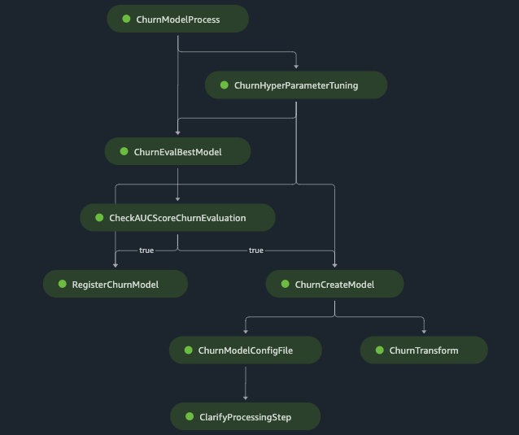

# Customer-Churn-SageMaker

This project demonstrates how to build, tune, and deploy an end-to-end churn prediction model using **Amazon SageMaker Pipelines**. 

The goal is to identify customers at risk of churning using a dataset of customer behavior and transaction history, helping businesses retain their customer base.

---

##  Dataset

We use the [Store Retail Dataset](https://www.kaggle.com/uttamp/store-data) to build a binary classification model that predicts whether a customer will be retained.

### Sample Data (After Preprocessing)

---

##  Pipeline Workflow

This project is implemented using **Amazon SageMaker Pipelines** to manage the end-to-end ML workflow, including preprocessing, training, evaluation, and model registration.

---

##  Pipeline Steps

1. **ChurnPreprocessing (Processing Step)**  
   - Load CSV from S3, parse dates, engineer features, one-hot encode, and split into train/val/test sets.

2. **ChurnModelTuning (Hyperparameter Tuning Step)**  
   - Run SageMaker XGBoost with HPO to tune hyperparameters for best AUC score.

3. **EvaluateModel (Processing Step)**  
   - Evaluate the top model on the test set and calculate the AUC.

4. **CheckAUCCondition (Condition Step)**  
   - Proceed only if AUC > 0.75.

5. **RegisterChurnModel (RegisterModel Step)**  
   - Register the best performing model to SageMaker Model Registry.

6. **(Optional Extensions)**  
   - Create model, run batch transform, generate explainability reports using Clarify, etc.

---

